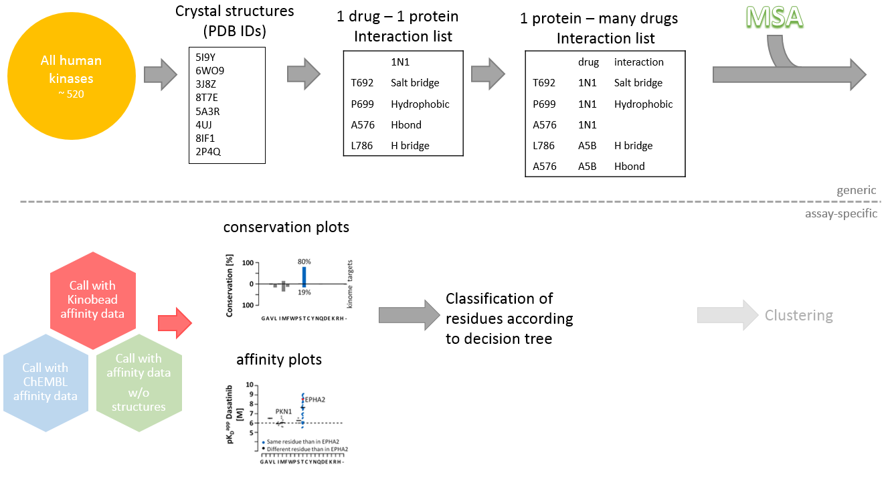

# Characterization of Kinase Residues

This project supports rationale-driven discovery of kinase inhibitors. It combines high-throughput affinity data with crystal-structures to characterize the residues of kinases which engage in interaction with inhibitors. For easy accessibility, it is implemented as a truly magical R Shiny application.

<h1 align="center">
     
     
    
     
     
</h1>

The vast majority of code of project is written in R. The individual scripts are described below. Files encoding functions have the prefix "lib_"; files containing scripts have the prefix "script_".

### script_generation_of_underlying_dataset.R
In `script_generation_of_underlying_dataset.R`, the underlying dataset for the Shiny app is created. First, `lib_generate_generic_dataset.R` creates a dataframe which contains the PDB structures (PDB IDs) of interest, which have a [PLIP](https://plip.biotec.tu-dresden.de/plip-web/plip/index) output. The kinase gene names are added from the [pkinfam file](https://www.uniprot.org/docs/pkinfam). Subsequently, PDB is searched with these kinase genenames to get the respective structure IDs. The kinase familiy information is added from pkinfam.

As the second step, the PLIP output is parsed to creade a "many-kinases-many-drugs-dataframe (mkmd) in `lib_generate_mkmd.R`. The function in `lib_PLIP_XML_parser.R` parses the PLIP XML output files and returns a dataframe.
The further operations aren't described in detail here but are extensively documented in the script.

### script_prepare_Kinobead_call_set.R
This short script contains the transformation of the supplement-Excel file from the "target landscape of clinical kinase drugs" paper (Klaeger et al., 10.1126/science.aan4368) into a suitable input file for the Shiny app.

### lib_PLIP_XML_parser.R
Takes the XML output-files from PLIP and returns a dataframe with the
interacting residues and the kind of calculated interaction.
